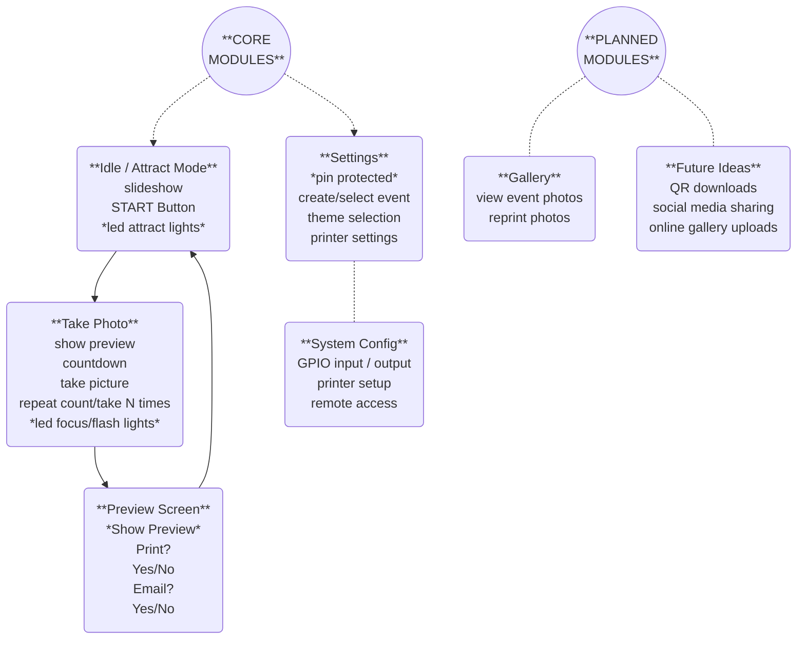

# Phototron

A modern, touch-friendly **photo booth** app designed for Raspberry Pi kiosks (works on desktop for dev), with **3-shot capture**, **auto-collage**, **one-tap printing**, and **optional email delivery**. It started as a replacement for `pibooth` after that project fell behind recent Pi OS updates—and because… I wanted something cleaner and easier to tweak.

- Touch UX, modal prompts (Print? → Email?)
- Direct CUPS printing (`lp`) with pre-configured settings
- Email sending via SMTP, with **retry queue** if offline
- Configurable **flash relay** + **NeoPixel ring** for feedback
- Event-based file structure with per-event logos & outputs
- A real **Settings** screen driven by a config schema you control


*Full planning chart showing navigation and module structure.*

---

## Messy Description

*9/15/2025 - This is my less eloquent description of the state of the project.*

I built this to replace PiBooth on a photobooth kiosk I built for my wife a couple years ago.  Read more about it [here...](https://xtonyx.org/phototron)

Despite my plans, I had a deadline. I got a working version of this completed in time for my wife to use it at an office party today.  I'm pushing it now that I've got a working version.  All old pushes were strictly to save states, and transfer work from one computer to another.

Idle screen works and displays an actively updated slideshow of photo collages.  Click START to initiate a 3 shot photo session, which generates a collage of three photos (template based). Displays a preview of this collage, and prompts the user to print and/or email it.  Print works via a simple CUPS call.  Email works via gmail SMTP and html templates.  Returns to idle slideshow after each photo session.  

Settings screen implementation has begun, but is not close to perfect as I had to push things to meet the deadline.  Settings screen is customizable based on a template. Initial start generates a user_config.cfg file, and settings screen allows modification of specified values via an editable_keys file, so it can be customized. User_config would need to be deleted manually if core config.cfg is changed, so note that.

Current light config is a bit of a mess.  My neopixel ring died, so there are untest stubs that exist.  Currently running two LED strips via mosfets driven by PWM on pin 18 & 19. Allows some interesting "attract" light patterns.  Currently shows a few different patterns on idle, 50% power at preview, and brief 100% lighting as a flash during capture.

There are lots of files marked OLD, where I had to change plans and didn't want to lose previouos work but didn't want to push a git. A lot of TEST files as well, most of these run on their own to try things without moving through the whole process.  

I plan on cleaning up this codebase and figuring out how to package it once it's in a state that others might want to play with.

Have fun digging through my mess.

---

## Status

Actively under development. Core flow works end-to-end on my bench:

- ✅ 3× photo capture with countdowns  
- ✅ Collage generation (4×6 portrait, three photos + logo quadrant)  
- ✅ Preview screen with widget **Print?** then **Email?** 
- ✅ CUPS print job via `lp` (no prompts) 
- ✅ Portrait orientation display
- ✅ Full touch operation, touch keyboard for user inputs.
- ✅ SMTP email send with queued retries if it fails  
- ✅ Flash relay + NeoPixel ring hooks  
- ✅ Settings UI generated from a config schema  
- 🚧 Idle slideshow & gallery viewer are in progress  
- 🚧 Multi-camera & cross-platform niceties are being explored
- 🚧 Lots of extra files in current repo.. need to clean up my tests.

Current hardware is a Raspberry Pi 4 with Pi Camera Module 3 (Wide), a USB/HDMI touch screen, Canon Selphy CP1200 printer, and mosfet driven led strips. 

If you’re testing on macOS/Linux/Windows desktop, **mock camera** mode is supported. 

---

## Features (what it actually does)

- **Session flow**
  - Idle screen → Tap START → 3 captures with a 3-2-1 overlay → Collage render → Preview
  - Preview prompts are modal: **Print? Yes/No** then **Email? Yes/No**
- **Image pipeline**
  - Saves each raw capture to `events/<event>/raw/`
  - Renders a collage (top-left, top-right, bottom-left for photos; bottom-right for logo/text) to `events/<event>/comps/`
- **Printing**
  - Sends the collage directly to the default printer via `lp` (or a configured printer)
- **Email**
  - Simple email entry → sends with SMTP using a template in `app/templates/email/`
  - If email fails (no network, auth), it’s queued in `app/queue/email_queue.json` to retry later
- **Lights**
  - `flash` via a relay: off / on-during-preview / strobe-at-capture (modes are configurable)
  - `neopixel` ring for status/animation cues
- **Settings UI**
  - Generated from `app/editable_keys.cfg` so you can define what’s editable and how (checkbox, number, select, etc.)
  - Saves persistent overrides to `user_config.cfg` (keeps your defaults in `app/config.cfg` clean)
- **Events**
  - “Event” = an isolated workspace with its own logo and output folders

---

## Install

### 1) System requirements

- **Python 3.11+** (3.12/3.13 fine)  
- **Raspberry Pi OS 64-bit** recommended for kiosk use  
- **CUPS** installed and a working printer (default set, or name it in config)  
- For Pi cameras, install a camera stack (e.g., **libcamera/PiCamera2**) and enable the camera in raspi-config.

> Desktop dev (macOS/Linux) works in mock-camera mode.

### 2) Clone & set up

```bash
git clone https://github.com/you/phototron.git
cd phototron
python3 -m venv .venv
source .venv/bin/activate   # Windows: .venv\Scripts\activate
pip install -r requirements.txt
```

### 3) CUPS (printing)

Make sure your target 4×6 photo printer is installed and working from the OS.  
Set it as default **or** provide `printer_name` in the config (see below).

---

## Run

```bash
# from repo root
python main.py
```

On Pi, run in your kiosk session (fullscreen window manager / autostart, etc.).  
If you’re just testing on desktop, it will use mock capture unless configured for a real camera.

---

## Configuration

There are **three** moving parts:

1) **Defaults**: `app/config.cfg` (TOML)  
2) **Editable schema**: `app/editable_keys.cfg` (tells Settings which keys exist and how to render them)  
3) **User overrides**: `user_config.cfg` (created/updated by the Settings screen)

**Recommended workflow**  
- Keep long-term defaults in `app/config.cfg`.  
- Decide which values are user-tweakable in `app/editable_keys.cfg`.  
- Let operators change things in the app; those changes persist to `user_config.cfg`.

### Important sections (from `app/config.cfg`)

- `[app]` — app-level toggles, paths, event, style, timeouts
- `[camera]` — device/backend, resolution, mock vs real
- `[printer]` — `printer_name`, `paper_size`, `copies`
- `[lights]` — `enable_flash`, `flash_mode`, `enable_neopixel`, pins, counts, brightness
- `[idle_screen]` — slideshow enable, transitions, timings
- `[email]` — SMTP server creds, template selection, disclaimer text

> The Settings screen only exposes what’s whitelisted in `app/editable_keys.cfg`.  
> Example: you can define a field like `select:flash_modes` and map it to the lights section.

---

## Events & Assets

```
events/
  default/
    raw/      # raw captures
    comps/    # collage outputs
    logo.png  # used in collage bottom-right quadrant
```

Pick the active event in Settings, or set it in config.  
Collage/logo templates live in `app/templates/collage/` and `app/templates/photo/`.

---

## Email

- Templates: `app/templates/email/`  
- Queue file: `app/queue/email_queue.json` (failed sends get retried)  
- Configure SMTP in `[email]` of your config (server, port, TLS, username, password).  
- After a successful send, the preview shows a transient “Sent!” style state.

---

## Lights (Flash + NeoPixel)

- **Flash relay**: set `enable_flash = true`, pick `flash_mode = "preview" | "flash" | "off"`  
- **NeoPixel ring**: set `enable_neopixel = true` and configure pin/count/brightness  
- Hardware test scripts: `test_lights.py`, `test_neo.py`, `test_pwm.py`

> GPIO pins default to typical Pi values; adjust them per your hat/relay board.

---

## Printing

Phototron shells out to `lp` so the OS decides media profile and spooling.  
Configure:
- Set your printer default at the OS level **or** set `printer_name` in `[printer]`
- Use `paper_size` if your CUPS queue accepts it as an option (optional)
- This is the simplest way to do it. Period.

---

## Developer Notes

- **Tech stack**: Python, PySide6/Qt, NumPy, Pillow, TOML (via `tomli-w`), CUPS `lp`  
- **App structure**:
  - `app/screens/*` (UI screens)
  - `app/camera.py`, `app/collage_renderer.py`, `app/print.py`, `app/emailer.py`, `app/lights.py`
  - `app/styles/default/style.qss` (theme)
  - `app/editable_keys.cfg` → generates Settings UI fields dynamically
- **Mock mode**: desktop runs without a physical camera; capture saves simulated frames
- **Known quirks**:
  - If `lp` fails silently, check that your CUPS queue has a driver, correct media, and is set default (or specify `printer_name`).
  - Email send requires working SMTP; failures should appear in the queue file.
  - NeoPixel requires proper permissions on Pi (SPI/PWM), and correct library installed if you wire it up.

---

## Roadmap

- Idle **slideshow** with transitions (configurable)
- In-app **gallery** viewer for the current event  
- Better **multi-camera** support (USB + PiCam, separate preview/capture devices)  
- External **template preview** scripts (collage/email)  
- Regenerate collages from **raws** post-event  
- Event-specific **style packs** and on-device selector  
- Optional **QR download** flow and social sharing

---

## Contributing / Local conventions

- Keep defaults in `app/config.cfg`.  
- Only put operator-facing settings in `app/editable_keys.cfg`.  
- Don’t delete raw photos. Retakes should be archived, not removed.  
- Try not to break printing or email flows—both are designed to be prompt-free and resilient.
- Passwords saved in non-tracked `app/accounts.py'

---

## License

Phototron is licensed under [CC BY-NC-SA 4.0](https://creativecommons.org/licenses/by-nc-sa/4.0/).  
Use and remix it, but **credit me**, **don’t sell it**, and **share changes** under the same terms.
